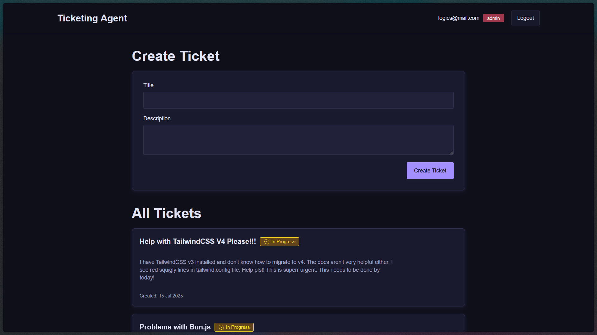

<div align="center">

# 🎫 Ticketing Agent

A minimal implementation of an AI agent using **Inngest**.



</div>

## ✨ Features

- AI-powered ticket handling
- Simple agent workflows
- Modern UI with React
- Role-based access
- Real-time ticket updates
- Learning-focused codebase

## 🧰 Tech Stack

- Node.js & Express
- React + Vite
- Inngest (event-driven workflows)
- Shadcn UI
- Zod & React Hook Form
- MongoDB (via Mongoose)
- Mailtrap (emails)

## 🚀 Getting Started

1. Clone the repository
   ```bash
   git clone <repo-url>
   cd ticketing-agent
   ```
2. Install dependencies:
   ```bash
   cd server && npm install
   cd ../client && npm install
   ```
3. Set up environment variables (see `.env.sample` in client & server)
4. Start the servers:

   ```bash
   # Terminal 1
   cd client && npm run dev

   # Terminal 2
   cd server && npm run dev

   # Terminal 3
   cd server && npm run inngest-dev
   ```

5. Open [http://localhost:5173](http://localhost:5173) in your browser(Frontend)

6. Open [http://localhost:8288](http://localhost:8288) in your browser(Inngest runs)

## 🛠️ Development

- Built for learning Inngest and AI agent basics
- Modular, minimal, and easy to extend
- Uses Prettier and ESLint for code quality

## 💙 Acknowledgements

- [Inngest](https://www.inngest.com/) for event-driven workflows
- [Shadcn UI](https://ui.shadcn.com/) for UI components
- [Zod](https://zod.dev/) & [React Hook Form](https://react-hook-form.com/) for forms

<div align="center">

<strong>⭐ Leave a star maybe? ⭐</strong>

<a href="https://github.com/buneeIsSlo/ticketing-agent">Source</a>
| <a href="https://twitter.com/awwbhi2" target="_blank">Twitter</a>
| <a href="https://github.com/buneeIsSlo" target="_blank">GitHub</a>

</div>
